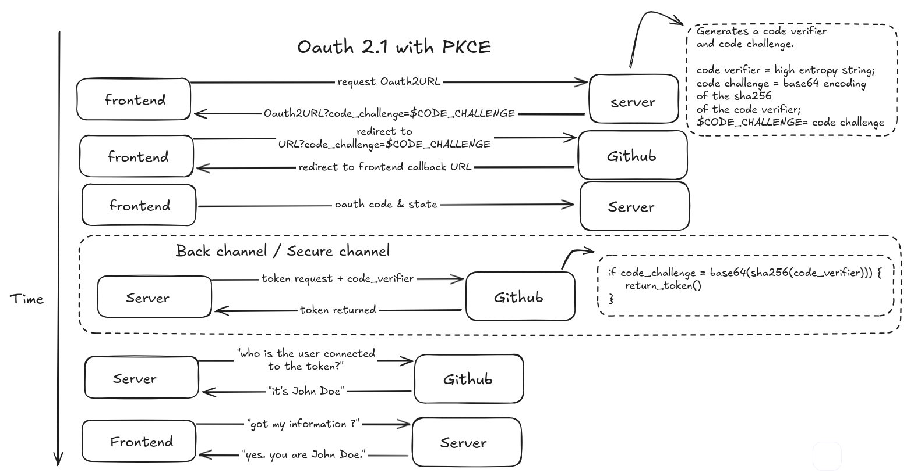

# The web version of ghpm

> [!WARNING]
> Turning a starred repository into a private repository will lose all the stars  
> Current forks will remain public and will be detached from the repository.

> [!NOTE]
> I am not sponsored by github, nor affiliated, but you can change that by pinging them on social media. And ask for this functionality to be integrated directly into the gh CLI and on the github UI.

## GHPM the web version

This is a web version of the ghpm cli.

- https://github.com/Neal-C/gh-ghpm
- https://github.com/Neal-C/gh-ghpm-rs
- https://github.com/Neal-C/ghpm

The web version allows to switch your repositories between public and private with a few clicks.

It uses Oauth2 with github to perform actions on your behalf.

## System

## Oauth2 flow

> [!NOTE]
> I am using the "state" flow because github does not support the "PKCE" flow, which is the recommended flow.

### OAuth2.1 with PKCE Authentication

As of February 2025, GitHub does not support OAuth2.1 with PKCE authentication

https://docs.github.com/en/apps/oauth-apps/building-oauth-apps/authorizing-oauth-apps

> The PKCE (Proof Key for Code Exchange) parameters code_challenge and code_challenge_method are not supported at this time. CORS pre-flight requests (OPTIONS) are not supported at this time.

This flow will be used as soon as possible (the PR is ready).

In the meantime, the "state" flow will be used.

The state parameter is used to prevent CSRF attacks.

## How to permanently delete or hide data from a repository ?

Only sure way is to contact github support : https://support.github.com/

When in doubt, revoke and rotate your keys. Or better yet, automate it.

## Tech stack and design decisions

Contact me ;)

---

Made with 💞 love 💞 for developers by a developer ❤️